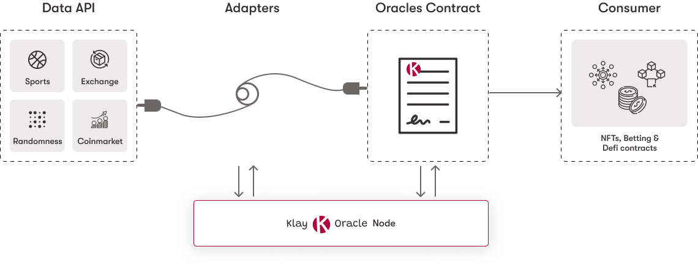

# About

### What is KlayOracle

KlayOracle adopts the design used by leading and existing oracles to bring offchain data to Klaytn Smart Contracts. Its straight forward to setup to access offchain data such as prices, sport data, weather data, random numbers or any external API usecase suites your project purpose.

### Why Use KlayOracle

**Reliable Data Feed:** Get reliable price, weather, and external API data for your Defi and GameFi apps. Additionally, obtain uniquely generated numbers for your smart contract use cases.

**Customizable Adapter:** Without relying on external data feeds, which may be fraudulent, you can quickly set up adapters to aggregate API data for any off-chain data you need to allow.

**Self Hosted Node:** KlayOracle currently relies on you configuring your own adapters and node. to manage the node or nodes and have faith that you are receiving expected off-chain data that is genuine.

### Products

- Random Numbers
- Data Feed

<figure><figcaption></figcaption></figure>

<iframe width="560" height="315" src="https://www.youtube.com/embed/nC-LlVKuNL0" title="YouTube video player" frameborder="0" allow="accelerometer; autoplay; clipboard-write; encrypted-media; gyroscope; picture-in-picture" allowfullscreen></iframe>


